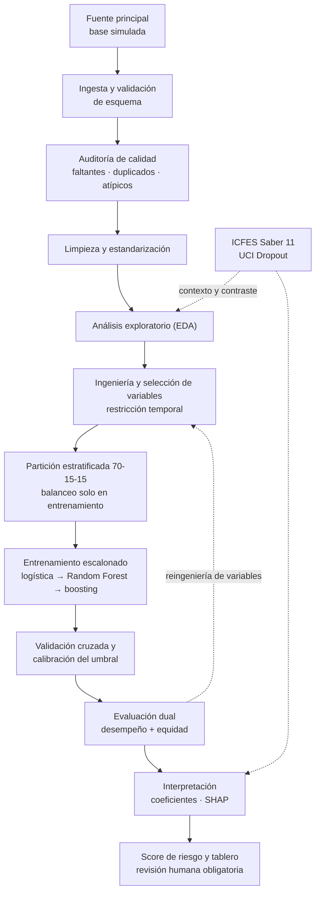

# AlertaEdu — Identificación temprana del riesgo de deserción escolar mediante Ciencia de Datos

Proyecto académico de Ciencia de Datos Aplicada · 2026

**Estado del proyecto:** Fase 1 completada (formulación y plan de trabajo) · Fase 2 en curso (análisis exploratorio)
**Metodología:** CRISP-DM · **Lenguaje:** Python 3.11 · **ODS asociado:** ODS 9, Meta 9.b

---

## 1. Descripción

AlertaEdu es un sistema analítico de alerta temprana orientado a estimar el riesgo de deserción escolar en estudiantes de educación secundaria, con el fin de que las instituciones educativas puedan focalizar acciones de acompañamiento **antes** de que el abandono se concrete.

El proyecto parte de un diagnóstico común en la gestión escolar: la deserción suele detectarse cuando el estudiante ya acumuló inasistencias prolongadas o reprobó el año lectivo, de modo que la intervención llega tarde. AlertaEdu propone desplazar esa gestión de un enfoque reactivo a uno preventivo mediante modelos de clasificación supervisada entrenados con información académica, socioeconómica y comportamental disponible en las primeras semanas del calendario escolar.

> **Alcance declarado.** Este es un proyecto académico de prueba de concepto metodológica. El modelo principal se entrena sobre una base simulada; sus resultados **no** constituyen evidencia sobre estudiantes reales ni deben usarse para tomar decisiones que afecten a personas concretas sin una validación posterior con datos institucionales reales y aprobación ética.

---

## 2. Pregunta analítica central

> ¿En qué medida es posible predecir tempranamente el riesgo de deserción escolar en estudiantes de educación secundaria mediante modelos de aprendizaje automático entrenados con variables socioeconómicas, académicas y comportamentales, de manera que se maximice la sensibilidad en la detección sin generar sesgos discriminatorios?

**Preguntas secundarias**

1. ¿Qué variables presentan mayor importancia relativa en la caracterización de estudiantes en condición de vulnerabilidad?
2. ¿Cómo influyen el historial de asistencia y las calificaciones tempranas en la probabilidad de abandono?
3. ¿Cómo varían los patrones de deserción entre contextos educativos y niveles socioeconómicos distintos?
4. ¿Qué umbral de decisión optimiza el balance entre falsos positivos y falsos negativos dada la capacidad real de acompañamiento de la institución?

---

## 3. Objetivos

**De negocio (gestión educativa)**
Clasificar a los estudiantes en niveles de riesgo (alto, medio, bajo) para priorizar el 100 % de los casos de riesgo alto en tutorías y acompañamiento psicosocial, sobre la base de registros administrativos ya existentes, en un horizonte de diez semanas.

**Analíticos**
Formular, entrenar y evaluar modelos de clasificación supervisada con métricas de sensibilidad (Recall, F1, PR-AUC, ROC-AUC) y de equidad entre subgrupos, restringiendo el espacio de características a información disponible durante el primer tercio del año lectivo, entre las semanas 8 y 11 del cronograma.

---

## 4. Fuentes de datos

| Fuente | Rol | Contexto | Uso en el proyecto |
|---|---|---|---|
| Base simulada de educación secundaria (7.575 registros, 13 variables) | **Principal** | Entorno controlado | Entrenamiento, validación y prueba del modelo predictivo |
| ICFES Saber 11 · 2020-2 | Complementaria | Colombia | Caracterización socioeconómica y familiar a gran escala |
| UCI *Predict Students' Dropout and Academic Success* | Complementaria | Portugal | Referencia metodológica sobre factores asociados al abandono |

**Aclaración metodológica.** Las tres fuentes corresponden a contextos, niveles de agregación y marcos temporales distintos. **No se realiza ninguna unión fila a fila entre ellas.** Cada dataset se procesa de forma independiente: la base simulada constituye el núcleo del modelo, mientras que ICFES y UCI aportan evidencia de dominio para contrastar e interpretar los factores encontrados.

Los microdatos originales **no se versionan en este repositorio**. La carpeta `data/raw/` está excluida en `.gitignore`; las instrucciones de descarga y las rutas esperadas se documentan en `docs/diccionario_datos.md`.

---

## 5. Arquitectura del pipeline



El diagrama completo en alta resolución está en [`docs/pipeline.svg`](docs/pipeline.svg).

---

## 6. Reproducibilidad

```bash
git clone https://github.com/<usuario>/alertaedu.git
cd alertaedu
python -m venv .venv && source .venv/bin/activate    # Windows: .venv\Scripts\activate
pip install -r requirements.txt
```

Ejecución del pipeline de extremo a extremo:

```bash
python -m src.ingest      --config config/base_simulada.yaml
python -m src.quality     --input data/raw/05_educacion_desempeno_academico.csv
python -m src.clean
python -m src.features
python -m src.train       --model all --seed 42
python -m src.evaluate    --report reports/evaluacion.md
```

Todos los procesos usan semilla fija (`SEED = 42`) y registran su configuración en `reports/`. Los notebooks son de exploración; **la lógica que alimenta resultados reportables vive en `src/`**, no en celdas sueltas.

---

## 7. Convenciones de trabajo

**Ramas**

| Rama | Propósito |
|---|---|
| `main` | Versión estable; solo recibe cambios revisados |
| `develop` | Integración continua del equipo |
| `feature/<nombre>` | Trabajo individual por fase del pipeline |

**Mensajes de commit** — formato `tipo: descripción en imperativo`

```
feat: agregar imputación por mediana en variables de asistencia
fix: corregir fuga temporal en el cálculo del índice de rendimiento
docs: actualizar bitácora de error del corte 2
refactor: extraer lógica de codificación a src/features.py
```

Ningún cambio entra a `main` sin revisión de pares (*pull request*) por parte del otro integrante.

---

## 8. Cronograma (semanas 5 a 14)

| Semanas | Fase | Hito |
|---|---|---|
| 5–6 | EDA y diagnóstico | Informe de exploración y calidad de datos |
| 7–8 | Preprocesamiento | Pipeline de limpieza reproducible |
| 9–10 | Modelamiento | Modelos entrenados y matriz comparativa |
| 11–12 | Evaluación | Reporte de desempeño y métricas de equidad |
| 13–14 | Cierre | Informe final y presentación ejecutiva |

---

## 9. Consideraciones éticas

El proyecto trabaja sobre un dominio sensible: la clasificación de menores de edad según su probabilidad de abandonar el sistema educativo. El equipo asume los siguientes compromisos.

- **Prevención de la estigmatización.** La salida del modelo es un insumo para asignar apoyo, nunca un criterio de exclusión, promoción o evaluación del estudiante. Ninguna alerta se ejecuta sin revisión humana.
- **Privacidad.** Los identificadores directos se remueven en la ingesta y los microdatos no se versionan en el repositorio, en línea con la Ley 1581 de 2012 sobre protección de datos personales en Colombia.
- **Equidad algorítmica.** Se audita explícitamente que la tasa de falsos negativos no sea sistemáticamente mayor en ningún subgrupo por estrato, género o procedencia; un falso negativo equivale a un estudiante que queda sin acompañamiento.
- **Transparencia sobre el estado de los resultados.** Mientras no se ejecute la fase de modelamiento, ninguna métrica se reporta como resultado: los hallazgos pendientes se señalan como tales.

### Vínculo con el ODS 9 (Meta 9.b)

La Meta 9.b promueve el desarrollo de tecnología, investigación e innovación nacionales en los países en desarrollo. AlertaEdu construye capacidad analítica local aplicada al sistema educativo colombiano: no importa una solución cerrada, sino que documenta un pipeline reproducible y auditable que una institución educativa puede adaptar a sus propios registros administrativos.

---

## 10. Equipo

| Integrante | Rol principal | Responsabilidades |
|---|---|---|
| Joel | Ingeniería y gestión de datos | Auditoría de calidad, limpieza, EDA, documentación del pipeline |
| Kinan | Modelamiento y analítica | Entrenamiento, validación, comparación de algoritmos, interpretación |
| Ambos | Trabajo colaborativo | Reflexión ética, documentación, informe final y presentación |

---

## 11. Referencias

- Cortez, P., & Silva, A. M. (2008). *Using data mining to predict secondary school student performance*. En A. Brito & J. Teixeira (Eds.), *Proceedings of the 5th Annual Future Business Technology Conference* (pp. 5–12). EUROSIS.
- Chapman, P., Clinton, J., Kerber, R., Khabaza, T., Reinartz, T., Shearer, C., & Wirth, R. (2000). *CRISP-DM 1.0: Step-by-step data mining guide*. SPSS Inc.
- Instituto Colombiano para la Evaluación de la Educación. (2024). *Microdatos del examen Saber 11*. https://www.icfes.gov.co/
- Organización de las Naciones Unidas. (2015). *Transformar nuestro mundo: la Agenda 2030 para el Desarrollo Sostenible* (A/RES/70/1).
- Provost, F., & Fawcett, T. (2013). *Data science for business*. O'Reilly Media.
- Realinho, V., Machado, J., Baptista, L., & Martins, M. V. (2022). Predicting student dropout and academic success. *Data, 7*(11), 146.
- Shmueli, G. (2010). To explain or to predict? *Statistical Science, 25*(3), 289–310.
